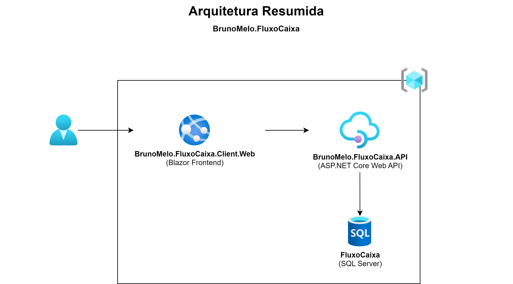

# Controle de Fluxo de Caixa

## Necessidade de negócio

Um comerciante precisa controlar o seu fluxo de caixa diário com os lançamentos (débitos e créditos), também precisa de um relatório que disponibilize o saldo diário consolidado.

Requisitos de Negócio:
- Serviço que faça o controle de lançamentos
- Serviço do consolidado diário

## Diagramas de Modelagem de Dados e Arquitetura

## Iniciando aplicação
### Configurando banco de dados
1. Instalar SqlLocalDB via SQL Server Express

   https://learn.microsoft.com/en-us/sql/database-engine/configure-windows/sql-server-express-localdb

É possível encontrar o arquivo (SQLLOCALDB.msi) na pasta:

    C:\SQL2019\ExpressAdv_ENU\1033_ENU_LP\x64\Setup\x64\SQLLOCALDB.msi

2. Abrir Prompt de Comando:

2.1. Caso a instância não esteja iniciada, executar comando abaixo:

    SqlLocalDB start MSSQLLocalDB

2.3. Caso a aplicação não conecte com a conexão padrão, tentar conectar utilizando o Pipe.
2.3.1. Verficar informações da instância criada:

    SqlLocalDB info MSSQLLocalDB
2.3.2. Copiar Instance pipe name: np:\\.\pipe\codigogerado\tsql\query
2.3.3. Substituir "(LocalDb)\\MSSQLLocalDB" pelo pipe recurado.

### Iniciar aplicação
1. Iniciar o serviço BrunoMelo.FluxoCaixa.API
2. Iniciar o serviço BrunoMelo.FluxoCaixa.Client.Web

Obs.: Clicando com o botão direito sobre a solução e acionando a opção "Set as startup project", é possível definir múltiplos projetos para inicialização e a sua ordem.

### Logando na aplicação
Para entrar na aplicação, utilizar as credenciais abaixo:

    Login: administrador@rfmelo.com
    Senha: fluxocaixa@2022